# Sistemas-Expertos-Receta
## Sistema experto que indica como salida una receta a partir de un conjunto de ingredientes ingresados o a partir de un nombre ingresado.
### Al iniciar el navegador web se mostrara una pequeña lista de opciones

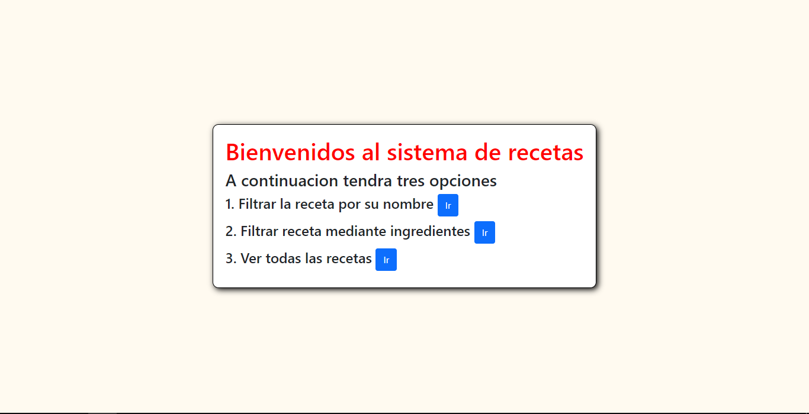

### El proyecto simplemente pedia crear una receta al ingresar una lista de ingredientes, pero adicionalmente se le agrego la opcion de filtrar por nombre
## FILTRAR POR NOMBRE
### Esta opcion nos botara una receta dependiendo del nombre que se ingrese
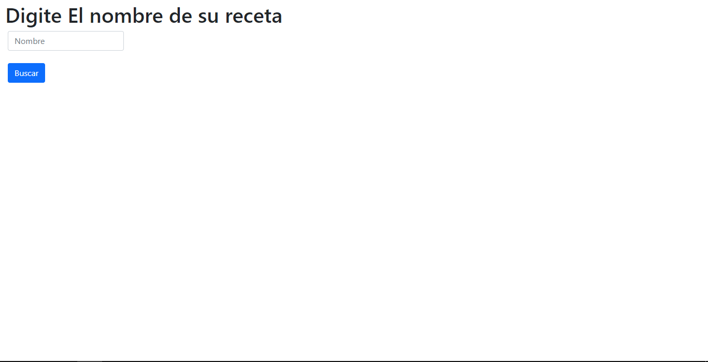
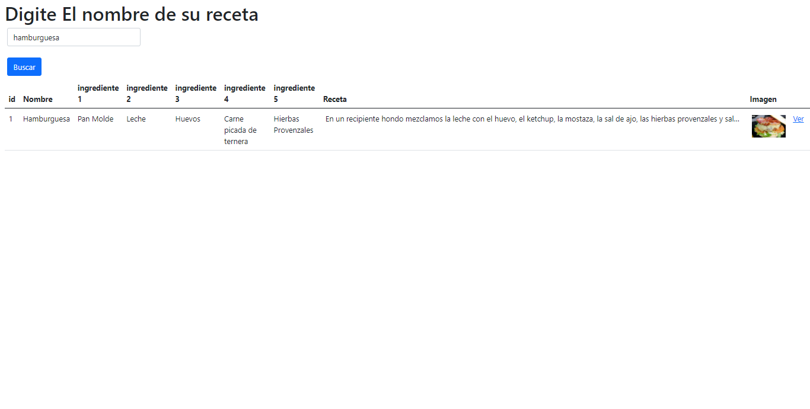
## FILTRAR POR INGREDIENTE
### Esta opcion nos botara una receta dependiendo de los ingredientes ingresados
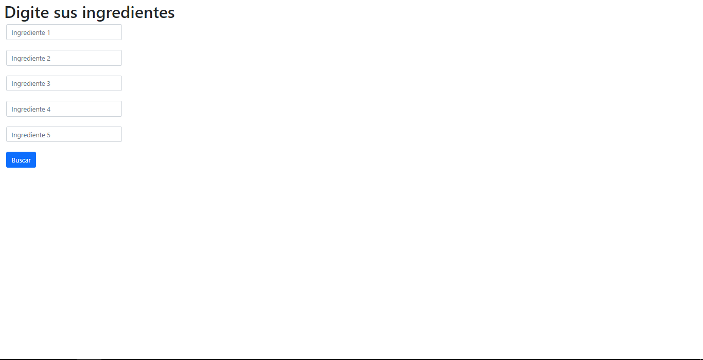
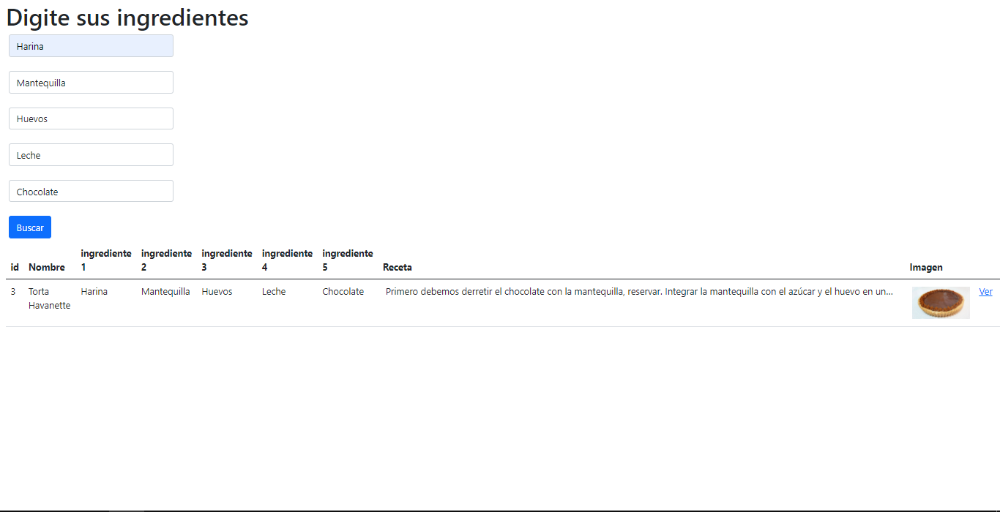
## FILTRAR LISTA DE INGREDIENTES
### Esta opcion simplemente desplegara la lista de recetas disponibles
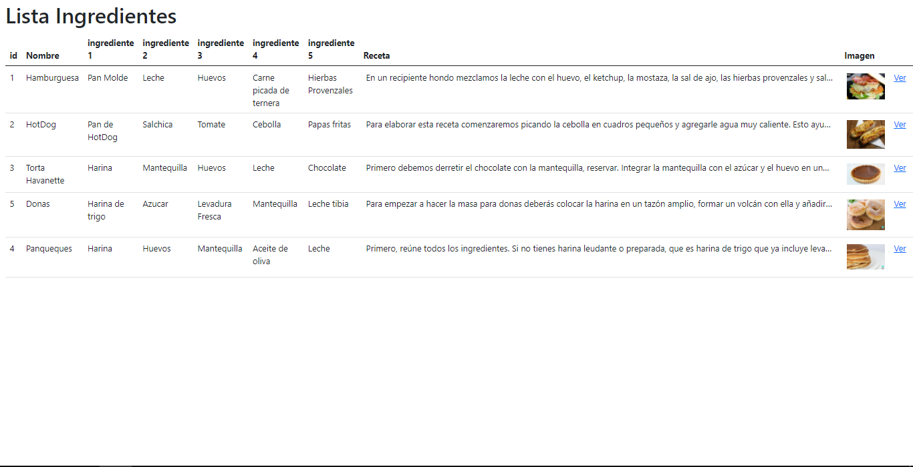

## DETALLE PRODUCTO

### Al final de la fila se encuentra un boton de 'ver', al presionarlos se abrira una ventana en la cual se mostrara por completo los datos de la receta seleccionada

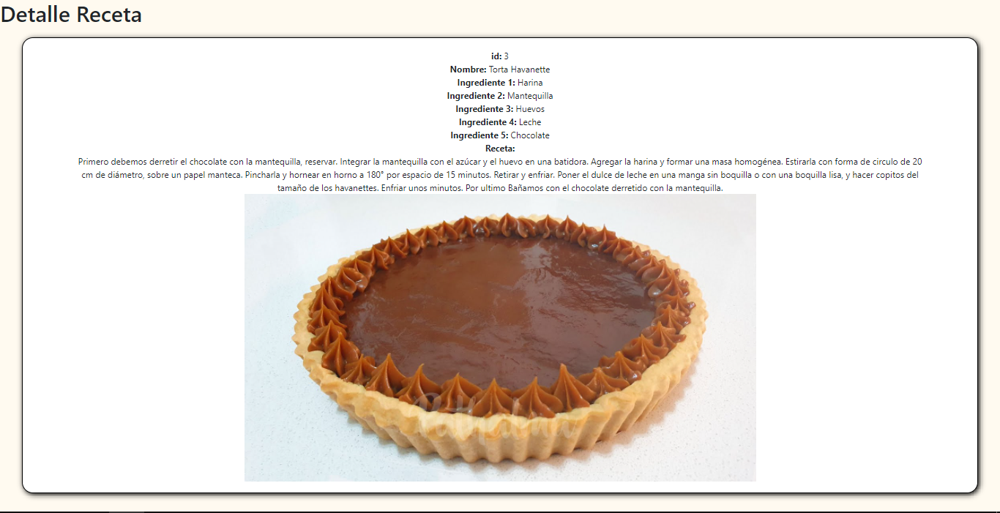

# FUNCIONAMIENTO DE LA APLICACION DESDE EL BACKEND

## FRAMEWORK

### Para la creacion de la aplicacion usamos el Framework Django escrito en lenguaje python

## RUTAS

### Django usa el modelo MVT(Model, View, Controller) lo que permite la facil comunicacion de la db con los datos, de esa manera renderizarlos en el template y con las rutas realizar una facil navegacion entre templates

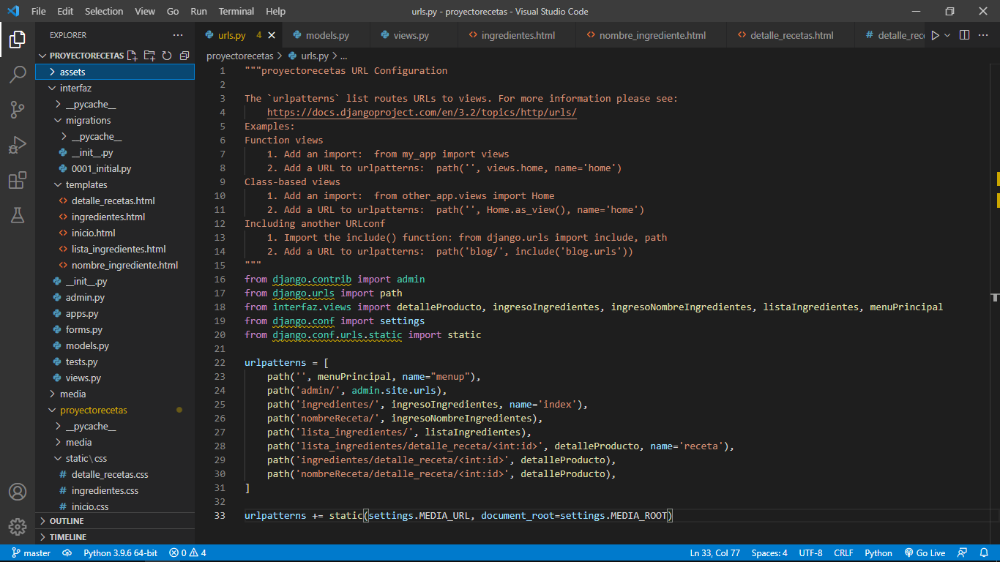

## FUNCION PARA FILTRAR DATOS

### En esta funcion de parte del HTML se creo un 'input' el cual guardaba los datos al dijita un igrediente/nombre, en la funcion se guarda el valor digitado en el input y se recorren las diversas columnas en las bases de datos buscando la coincidencia con la palabra digitada y el resultado encontado la funcion lo presenta en la plantilla HTML

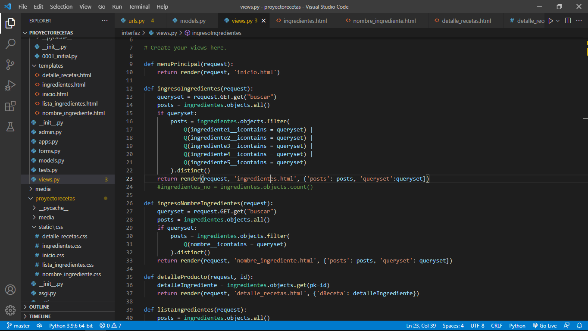
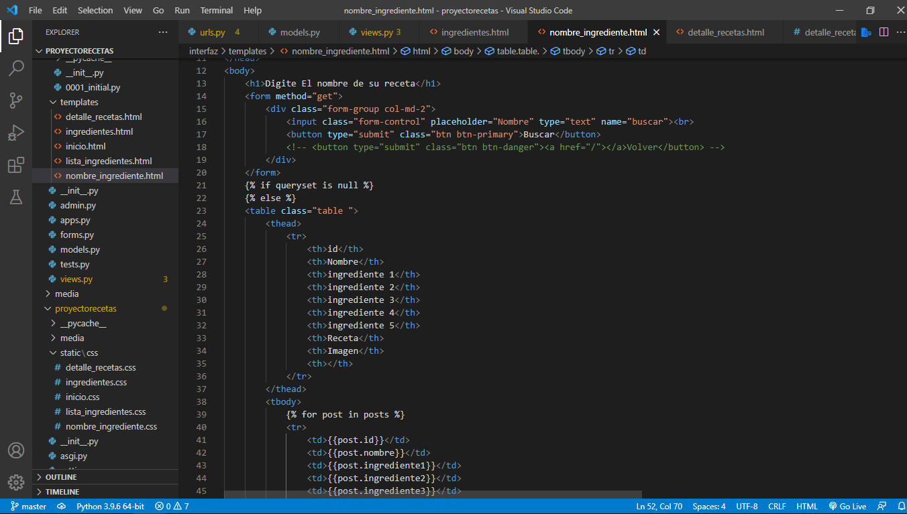

## BASE DE DATOS

### Aqui se muestra la base de datos la cual esta creada en Postgresql, a la izquierda se muestra la tabla y dentro todas las migraciones hechas por parte de Django

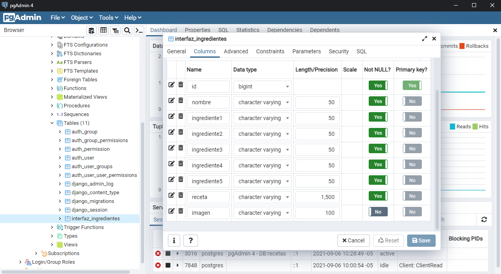

## SISTEMA ADMIN DJANGO

### Esta es la parte administrativa al cual solo el admin puede acceder para poder crear nuevas recetas como se muestra a continuacion, en la parte superior derecha se muestra el nombre del admin

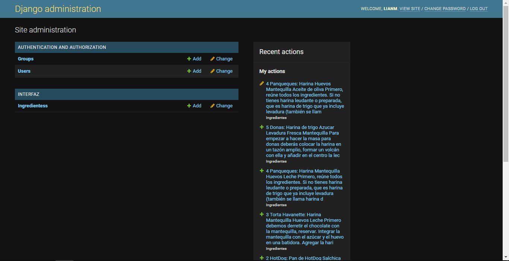
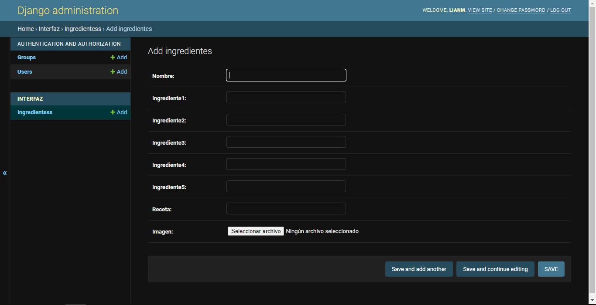

### En el repositorio se encuentran todos los archivos con sus respectivos datos para verificar la veracidad de lo mostrado
